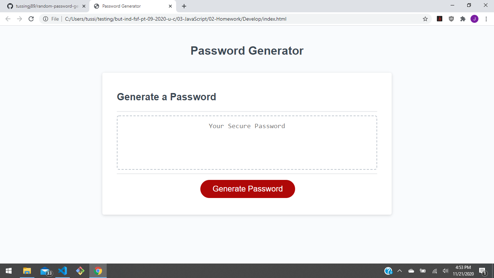

# random-password-generator
This project focuses on the use of javascript to create a random password generator. With the use of random function generators and prompts its easy to create a secure password.
Through this project I made use of functions to create random character, these functions were put into an array by selection through prompts.

# no install, no wait

This file works on any webpage, so the viewing of this project is as simple as following the link listed below.
https://tussingj89.github.io/random-password-generator/

# passwords made easy

Below is a sample of the code, each function will chooses a random character from the variable string. 

// function list 

function generateRandomLower() {
  var lower = "abcdefghijklmnopqrstuvwxyz"

  return lower[Math.floor(Math.random() * lower.length)]

}

function generateRandomUpper() {
  var upper = "ABCDEFGHIJKLMNOPQRSTUVWXYZ"

  return upper[Math.floor(Math.random() * upper.length)]

}

function generateRandomSpecial() {
  var special = "!@#$%^&*"

  return special[Math.floor(Math.random() * special.length)]

}

function GenerateRandomNumber() {
  var number = "0123456789"
 
  return number[Math.floor(Math.random() * number.length)]
}

# snapshot of the webpage

